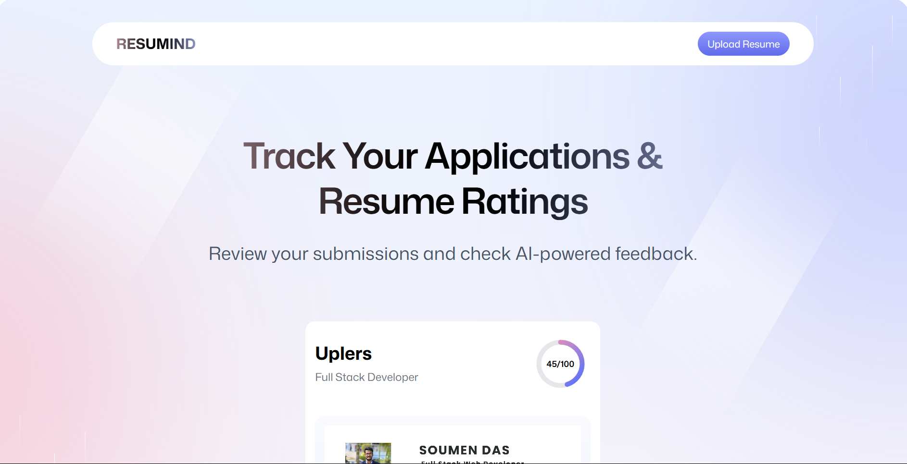
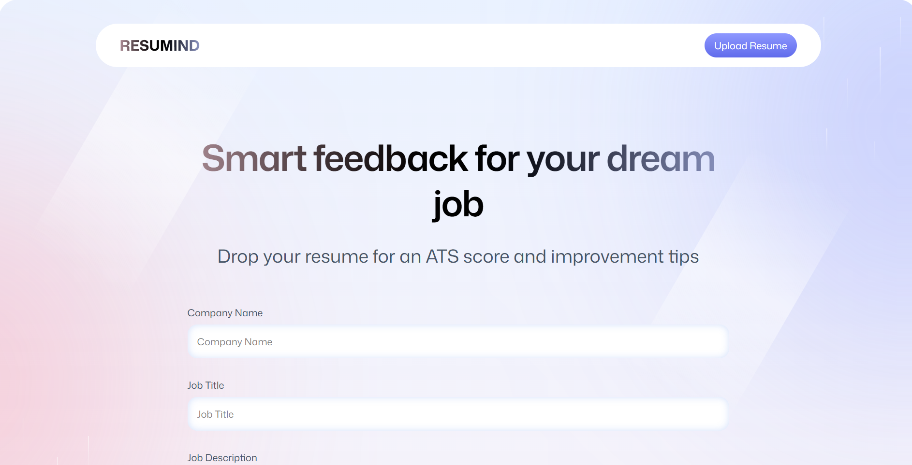
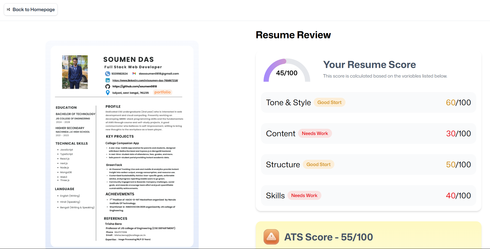

# Hire-IQ 🧠

<div align="center">
  
  
  
  
  
</div>

<br />

<div align="center">
  <h3>🚀 Smart AI-Powered Resume Analysis & Optimization Platform</h3>
  <p>Get intelligent feedback, ATS scores, and actionable insights to land your dream job</p>
</div>

## ✨ Features

### 🎯 **Intelligent Resume Analysis**
- **ATS Score Calculation** - Get your resume's Applicant Tracking System compatibility score
- **AI-Powered Feedback** - Receive detailed insights on tone, content, structure, and skills
- **Job-Specific Analysis** - Optimize your resume for specific companies and job titles
- **Real-time Scoring** - Instant feedback with actionable improvement suggestions

### 📊 **Comprehensive Scoring System**
- **Tone & Style** (60/100) - Professional language and formatting assessment
- **Content Quality** (30/100) - Relevance and impact of your experience
- **Structure & Layout** (50/100) - Organization and visual hierarchy
- **Skills Alignment** (40/100) - Technical and soft skills evaluation
- **Overall ATS Score** (55/100) - Complete applicant tracking system compatibility

### 💼 **Application Tracking**
- Track multiple job applications and their resume versions
- Monitor performance across different positions
- Historical analysis and improvement tracking
- Portfolio integration with professional profiles

## 🛠️ Tech Stack

### **Frontend**
- **React 19** - Latest React with enhanced performance
- **React Router 7** - Modern routing with data loading capabilities
- **TypeScript 5.8+** - Type-safe development experience
- **TailwindCSS 4.1+** - Utility-first styling framework
- **Zustand** - Lightweight state management

### **Backend & Storage**
- **Puter.js** - Cloud-based backend for data storage and management
- **PDF.js 5.3+** - Client-side PDF parsing and analysis
- **React Dropzone** - Drag-and-drop file upload interface

### **Development Tools**
- **Vite 6.3+** - Lightning-fast build tool with HMR
- **ESLint & Prettier** - Code quality and formatting
- **Docker Support** - Containerized deployment ready

## 🚀 Quick Start

### Prerequisites
- Node.js 18+ 
- npm or yarn package manager

### Installation

```bash
# Clone the repository
git clone https://github.com/soumen0818/Resume-Analyzer.git
cd Resume-Analyzer

# Install dependencies
npm install

# Start development server
npm run dev
```

Open [http://localhost:5173](http://localhost:5173) or visit [https://puter.com/app/hire-iq](https://puter.com/app/hire-iq) to view the live application.

### 🎯 Usage

1. **Upload Resume** - Drag and drop your PDF resume or click to browse
2. **Enter Job Details** - Specify the company name and job title you're targeting
3. **Get Analysis** - Receive comprehensive AI-powered feedback and scores
4. **Track Applications** - Monitor your application progress and performance
5. **Optimize & Improve** - Use insights to enhance your resume for better results

## 📱 Screenshots

### Dashboard Overview
Track all your applications and resume performance in one place.

<div align="center">
  
</div>

### Smart Analysis Engine
Get detailed feedback on every aspect of your resume with actionable improvement suggestions.

<div align="center">
  
</div>

### ATS Optimization
Ensure your resume passes through Applicant Tracking Systems with our specialized scoring algorithm.

<div align="center">
  
</div>

## 🏗️ Project Structure

```
Resume-Analyzer/
├── .react-router/          # React Router generated types
├── app/                    # React Router app directory
│   ├── components/         # Reusable UI components
│   ├── routes/            # Application routes
│   ├── styles/            # Global styles and themes
│   └── utils/             # Helper functions and utilities
├── build/                 # Production build output
├── constants/             # Application constants
├── node_modules/          # Dependencies
├── public/               # Static assets
├── types/                # TypeScript type definitions
├── .dockerignore         # Docker ignore file
├── .gitignore           # Git ignore file
├── Dockerfile           # Docker configuration
├── package-lock.json    # NPM lock file
├── package.json         # Project dependencies
├── react-router.config.ts # React Router configuration
├── README.md            # Project documentation
├── tsconfig.json        # TypeScript configuration
└── vite.config.ts       # Vite configuration
```

## 🔧 Available Scripts

```bash
npm run dev          # Start development server with HMR
npm run build        # Create production build
npm run start        # Start production server
npm run typecheck    # Run TypeScript type checking
npm test             # Run test suite
npm run lint         # Run ESLint
npm run format       # Format code with Prettier
```


### Platform Deployment
ResumInd is ready to deploy on:
- **Vercel** - Recommended for React apps
- **Netlify** - Static site hosting
- **AWS ECS** - Container-based deployment
- **Google Cloud Run** - Serverless containers
- **Railway** - Full-stack platform
- **Digital Ocean** - App platform

## 🤝 Contributing

We welcome contributions! Please see our [Contributing Guide](CONTRIBUTING.md) for details.

1. Fork the repository
2. Create a feature branch (`git checkout -b feature/amazing-feature`)
3. Commit your changes (`git commit -m 'Add amazing feature'`)
4. Push to the branch (`git push origin feature/amazing-feature`)
5. Open a Pull Request

## 📋 Roadmap

- [ ] **Integration with Job Boards** - Direct application submission
- [ ] **Cover Letter Generator** - AI-powered cover letter creation  
- [ ] **Interview Preparation** - Question suggestions based on resume
- [ ] **Mobile App** - React Native companion app
- [ ] **Premium Analytics** - Advanced insights and reporting
- [ ] **Team Collaboration** - Share and collaborate on resumes
- [ ] **API Integration** - Connect with LinkedIn, Indeed, and other platforms

## 📄 License

This project is licensed under the MIT License - see the [LICENSE](LICENSE) file for details.

## 🙏 Acknowledgments

- Built with ❤️ using React Router
- AI insights powered by advanced language models
- PDF processing with PDF.js
- Modern UI with TailwindCSS
- Icons from Lucide React
- Backend and storage powered by Puter.js

## 📞 Support

- 📧 **Email**: dassoumen0818@gmail.com
- 💬 **Discord**: soumen_0818
- 🐛 **Issues**: [GitHub Issues](https://github.com/soumen0818/Resume-Analyzer/issues)
- 🌐 **Live Demo**: [https://puter.com/app/hire-iq](https://puter.com/app/hire-iq)

---

<div align="center">
  <p>Made with ❤️ for job seekers worldwide</p>
  <p>⭐ Star this repo if Hire-IQ helped you land your dream job!</p>
</div>